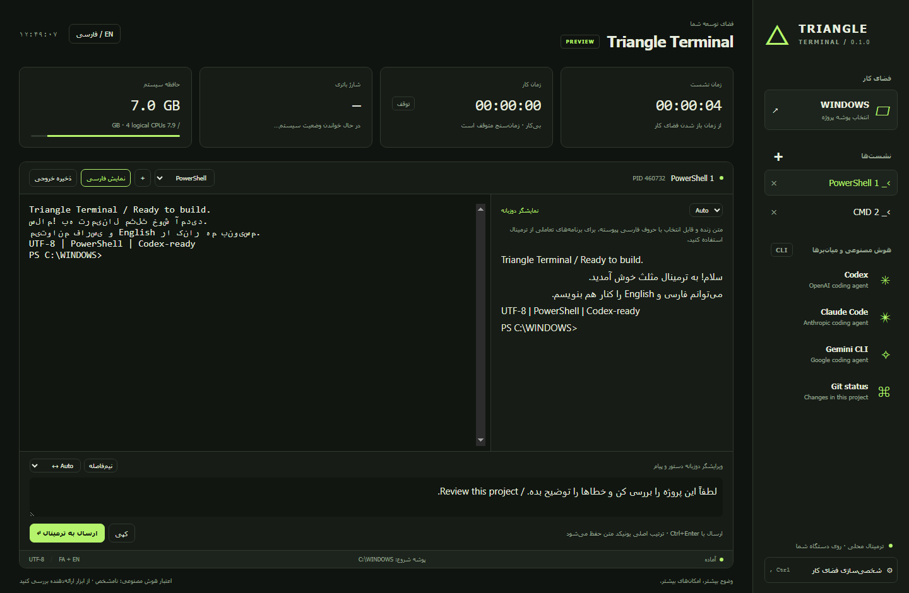

# ترمینال مثلث — Triangle Terminal △

ترمینال دسکتاپ ویندوز برای توسعه‌دهندگان فارسی‌زبان و انگلیسی‌زبان، با نشست‌های واقعی PowerShell و CMD، ویرایشگر دوزبانه، نمایشگر فارسی و میان‌بر ابزارهای هوش مصنوعی.

**ویندوز x64 · پیش‌نمایش 0.1.0 · مجوز MIT**

[English](README.md) · [مشارکت در پروژه](CONTRIBUTING.md) · [تغییرات](CHANGELOG.md)



## اجرا

فایل **Start-Triangle.cmd** را باز کنید. برای اجرای دستی:

```powershell
npm ci
npm start
```

به Node.js نسخه 22.12 یا جدیدتر و ویندوز ۱۰ یا ۱۱ از نوع x64 نیاز دارید. PowerShell 7 اختیاری است و باید جداگانه نصب شود. نسخه قابل حمل ویندوز، اگر توسط نگه‌دارنده منتشر شده باشد، به نصب جداگانه Node.js نیاز ندارد.

```powershell
.\triangle.cmd --shell powershell --language fa
```

## نوشتن فارسی

دستور یا پیام را در ویرایشگر پایین پنجره بنویسید و با **Ctrl+Enter** به برنامه فعال بفرستید. دکمه «نیم‌فاصله» نویسه استاندارد ZWNJ را درج می‌کند. نمایشگر فارسی در کنار ترمینال، متن را با حروف پیوسته و جهت مناسب نمایش می‌دهد.

این نسخه پیش‌نمایش است. نمایش راست‌به‌چپ و جابه‌جایی نشانگر درون همه برنامه‌های تمام‌صفحه شخص ثالث هنوز کامل نیست؛ برای خواندن فارسی از نمایشگر دوزبانه و برای تایپ از ویرایشگر استفاده کنید. رفتار یونیکد به برنامه مقصد و کنسول ویندوز نیز وابسته است.

## امکانات

- چند نشست مستقل، انتخاب پوشه پروژه و اجرای دستورهای بومی پوسته.
- پوسته‌های ظاهری، رنگ اصلی، اندازه و نوع قلم، نشانگر، تاریخچه و میان‌برهای قابل ویرایش.
- ساعت، زمان نشست، زمان کار با توقف هنگام بی‌کاری، شارژ واقعی باتری و مصرف حافظه.
- میان‌بر Codex، Claude Code و Gemini CLI؛ ابزارها و حساب آن‌ها باید جداگانه آماده شده باشند.
- ذخیره خروجی به UTF-8، کپی متن و ذخیره تنظیمات.

اعتبار حساب هوش مصنوعی و سهمیه باقی‌مانده هنوز متصل نیست و به‌صورت «نامشخص» نمایش داده می‌شود. زمان کار با مدت اجرای یک دستور یکسان نیست و با بسته شدن برنامه بازنشانی می‌شود.

راهنمای کامل، میان‌برهای صفحه‌کلید، آزمون‌ها و محدودیت‌ها در [README.md](README.md) آمده است.

## مشارکت و انتشار

گزارش خطا و پیشنهاد به فارسی یا انگلیسی پذیرفته می‌شود. برای مشارکت، [CONTRIBUTING.md](CONTRIBUTING.md) و برای آماده‌سازی مخزن، [راهنمای GitHub](docs/GITHUB.md) را بخوانید. پروژه با [مجوز MIT](LICENSE) ارائه می‌شود و وابسته به شرکت‌های ارائه‌دهنده هوش مصنوعی نیست.
