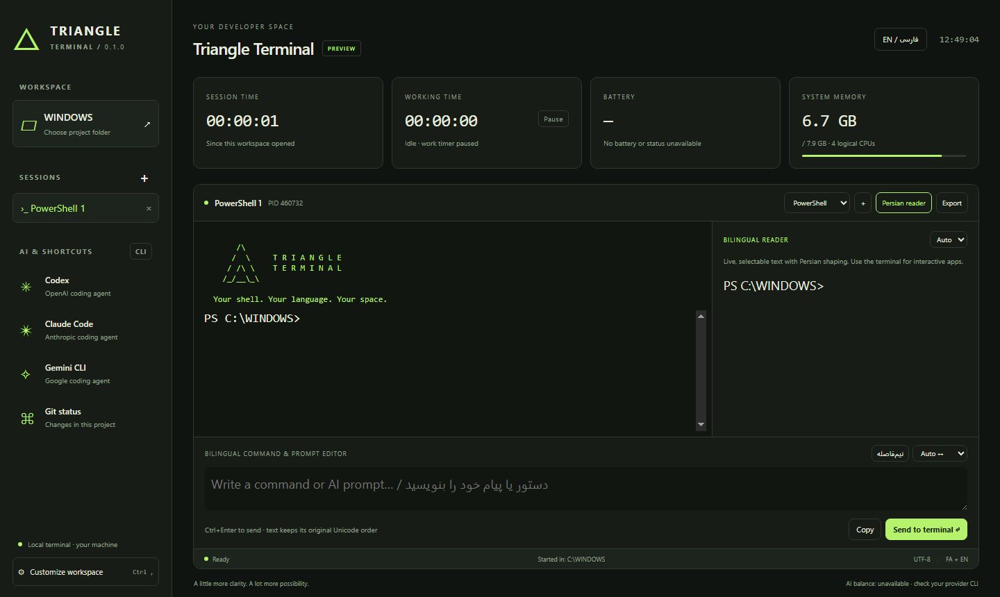

# Triangle Terminal △

A Windows desktop terminal for Persian and English developers. Real PowerShell and CMD sessions, a bilingual editor and reader, local CLI shortcuts, and a focused terminal workspace.

**Windows x64 · 0.1.0 preview · MIT**

[راهنمای فارسی](README.fa.md) · [Contributing](CONTRIBUTING.md) · [Changelog](CHANGELOG.md) · [Security](SECURITY.md)



## Start

Download or clone this repository and open its folder. Double-click **Start-Triangle.cmd**, or run:

```powershell
npm ci
npm start
```

Requires Windows 10/11 x64 with ConPTY support and Node.js 22.12 or newer for development. The launcher installs locked dependencies if missing. PowerShell 7 is optional and must be installed separately. macOS/Linux and Windows ARM64 are not supported by this preview.

If a maintainer has published a Windows prerelease, its portable EXE runs without a separate Node.js installation. Preview builds are unsigned. See [release instructions](docs/RELEASING.md) for building and verification; this README does not imply a hosted binary already exists.

The project includes a CLI launcher:

```powershell
.\triangle.cmd --help
.\triangle.cmd --cwd "C:\your project" --shell cmd --language fa
```

To make `triangle` available from other directories, optionally run `npm link` yourself. This changes your global npm command links. Launch options select the initial directory, shell, and language; appearance and shortcut preferences are configured in the app.

## Included

- Independent PowerShell, CMD, and optional PowerShell 7 tabs, real PTYs, terminal resizing, colors, interactive programs, shell history, Ctrl+C, and native shell commands.
- Triangle ASCII startup artwork, five themes, theme-matched accent colors, Inter UI typography, terminal font, font size, cursor, scrollback, default shell, and editable command shortcuts.
- Optional Windows Acrylic background material with saved blur amount, opacity, noise amount, and noise scale controls. Unsupported systems use a solid, readable fallback.
- Focus mode hides the workspace chrome and leaves the active terminal with a compact exit control.
- English/Persian interface, automatic or explicit editor direction, native browser Persian shaping, half-space (ZWNJ) insertion, and Unicode clipboard support.
- Live bilingual reader with connected Persian letters and bidirectional text layout. It follows the active terminal's most recent 600 physical buffer lines and joins wrapped lines.
- Project directory picker, per-tab editor drafts, transcript export, and confirmation before stopping sessions.
- Local clock, workspace elapsed time, focused work time with pause/resume and a 60-second idle threshold, real battery percentage when available, and system memory usage.
- Codex, Claude Code, Gemini CLI, and Git shortcut presets. Clicking a shortcut stages its command; sending it starts the installed tool in the current shell.

## Persian and interactive applications

Use the **bilingual editor** to compose Persian commands and AI prompts, then press **Ctrl+Enter**. Use the **bilingual reader** for shaped, selectable Persian output. Text is never reversed or converted into Arabic presentation-form code points before sending it.

The interactive xterm grid remains a conventional terminal renderer. Full bidirectional shaping and visual cursor navigation **inside every third-party full-screen CLI are not implemented**. The reader provides a separate text view; it does not reproduce full-screen application controls, colors, or interactive cursor positions. The target application and Windows console can also influence Unicode handling. This is a working preview, not a claim of universal Persian terminal compatibility.


The editor sends to whichever program owns the active session: a shell receives commands; an AI CLI receives prompts. At an integrated PowerShell prompt, Triangle inserts the full Unicode string into PSReadLine, avoiding loss of half-spaces through simulated key events. This session-local integration binds Enter and Ctrl+G and does not edit your profile. If PSReadLine is unavailable or constrained shell policies prevent integration, normal terminal input remains available but this enhanced path is unavailable. For other foreground programs, Enter/newline handling follows that program's paste mode. Multiline shell text can execute multiple commands. Direct terminal typing is available for normal interactive work.

## AI setup and charge indicators

Install and authenticate your preferred AI CLI separately. For Codex, follow the [official Codex CLI setup documentation](https://learn.chatgpt.com/docs/codex/cli), then select its shortcut and send `codex` from your project folder. Triangle uses that CLI's existing authentication and permissions; it does not require or store API keys.

Battery charge comes from Windows. **AI credit balance, remaining subscription allowance, token totals, and model cost are not connected**; the interface says unavailable rather than displaying invented values. Check your provider's own CLI/account tools. AI shortcuts can be edited to include any installed local AI tool.

Work time counts while Triangle is focused and the system has been active within 60 seconds. It is not command execution duration. Timers restart when the application restarts. The displayed project path is the session's starting directory; the shell prompt shows later directory changes.

## Background material and themes

Open **Customize workspace** to preview Midnight, Graphite, Blueprint, Vercel, or Paper before saving. Each theme carries its own accent color. The background controls tune Blur amount, Opacity, Noise amount, and Noise scale independently across the layered workspace surfaces. The frosted option uses Electron's native Acrylic material on supported Windows builds; the renderer keeps an opaque fallback for older systems and reduced-transparency preferences. Focus mode is available in the top bar or with **Ctrl+Shift+M**. See Electron's [window material options](https://www.electronjs.org/docs/latest/api/structures/base-window-options) and [title bar overlay guidance](https://www.electronjs.org/docs/latest/tutorial/custom-title-bar).

## Keyboard shortcuts

| Shortcut           | Action                                     |
| ------------------ | ------------------------------------------ |
| Ctrl+Shift+T       | New terminal with the selected shell       |
| Ctrl+Shift+W       | Close active terminal with confirmation    |
| Ctrl+Shift+F       | Focus bilingual editor                     |
| Ctrl+Shift+M       | Toggle terminal focus mode                 |
| Ctrl+Enter         | Send editor text to active terminal        |
| Ctrl+Shift+C       | Copy terminal selection                    |
| Ctrl+Shift+V       | Paste into the bilingual editor for review |
| Ctrl+,             | Customize workspace                        |
| Ctrl+C in terminal | Interrupt foreground program               |

Preferences are saved under Electron's user-data directory (`%APPDATA%\triangle-terminal\settings.json` by default). Terminal output and editor drafts are in memory unless you explicitly export/copy them. The PowerShell Unicode bridge briefly writes submitted editor text to a per-session temporary file, deletes it on consumption, and removes remaining files during normal session shutdown. An abnormal crash can leave a pending temporary file. Native shells and AI CLIs may maintain their own histories.

## Develop and verify

```powershell
npm run check
npm run test:smoke
```

The smoke test launches a hidden Electron window, runs harmless commands in actual PowerShell and CMD sessions, checks Persian text and UI behavior, and saves screenshots/results in `test-results/source/`. It uses isolated preferences and disables persistent PSReadLine history. A local mock CLI tests foreground Unicode input without an AI account.

To build a portable Windows executable, with additional free disk space and internet access:

```powershell
npm run dist
npm run test:packaged
```

The packager is installed from a separate lockfile only when packaging, to keep normal installation smaller. Build artifacts go in `release/`. The packaged smoke test checks the bundled app, including native PTY loading and the PowerShell integration. Distribution signing and automatic updates are not configured.

GitHub Actions runs Windows checks on pull requests and can build a portable EXE from a manual workflow or version tag. Neither workflow automatically publishes a release. See [GitHub setup](docs/GITHUB.md) and [release guidance](docs/RELEASING.md).

## Architecture

`src/main.cjs` owns PTYs, preferences, dialogs, and system telemetry. `src/preload.cjs` exposes a narrow validated IPC bridge. `src/renderer.js` implements xterm sessions, browser-shaped Persian views, and the UI. The renderer is sandboxed with Node integration disabled, context isolation enabled, a local-only content policy, blocked navigation, and denied browser permissions. There is no local HTTP server or remotely accessible shell endpoint.

Built with [Electron](https://www.electronjs.org/docs/latest/tutorial/security), [xterm.js](https://xtermjs.org/docs/), and [node-pty](https://github.com/microsoft/node-pty).

## License

[MIT](LICENSE). Dependency licenses are listed in [third-party notices](THIRD_PARTY_NOTICES.md). Triangle Terminal is an independent project, not affiliated with OpenAI or other AI CLI vendors.
